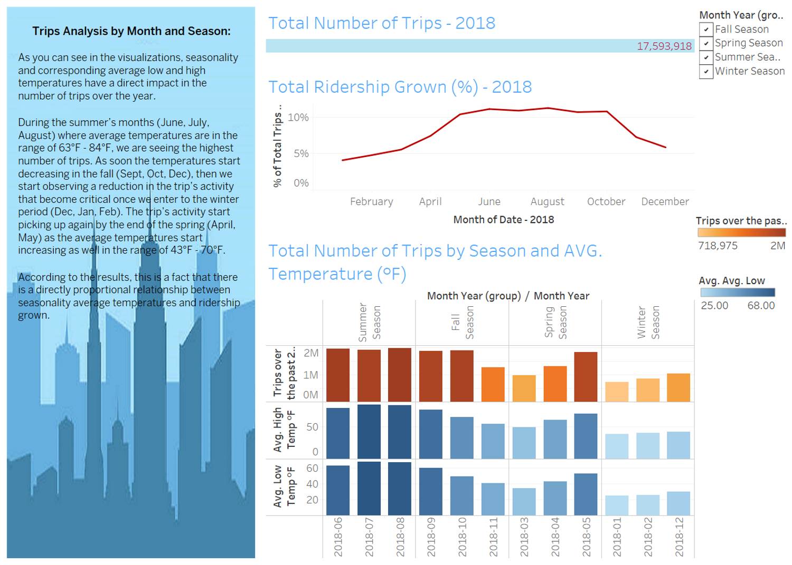
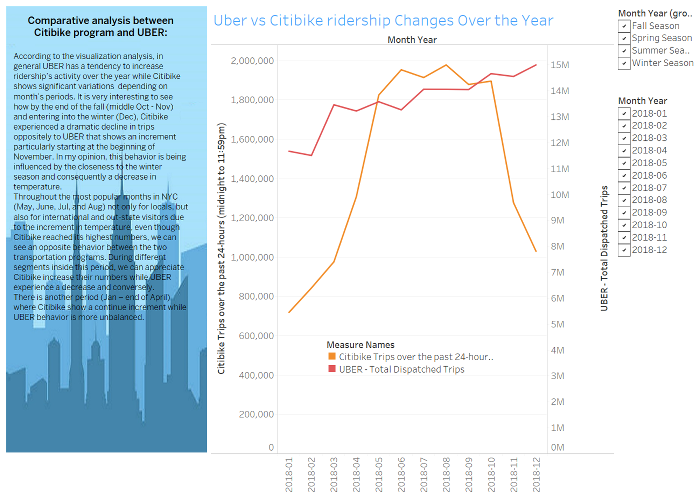

# Citi Bike Analysis

Since 2013, the Citi Bike Program has implemented a robust infrastructure for collecting data on the program's utilization. Through the team's efforts, each month bike data is collected, organized, and made public on the Citi Bike Data webpage.

Through an analysis of the New York Citi Bike Program 2018 data set, the objective of this project is to aggregate the data found in the Citi Bike Trip History Logs to find unexpected phenomena. Tableau will be used to analyse the data through visual intelligence.

# Some of the principal areas of analysis:

How many trips have been recorded total during the chosen period?

By what percentage has total ridership grown?

How has the proportion of short-term customers and annual subscribers changed?

What are the peak hours in which bikes are used during summer months?

What are the peak hours in which bikes are used during winter months?

Today, what are the top 10 stations in the city for starting a journey? (Based on data, why do you hypothesize these are the top locations?)

Today, what are the top 10 stations in the city for ending a journey? (Based on data, why?)

Today, what are the bottom 10 stations in the city for starting a journey? (Based on data, why?)

Today, what are the bottom 10 stations in the city for ending a journey (Based on data, why?)

Today, what is the gender breakdown of active participants (Male v. Female)?

How effective has gender outreach been in increasing female ridership over the timespan?

How does the average trip duration change by age?

What is the average distance in miles that a bike is ridden?

Which bikes (by ID) are most likely due for repair or inspection in the timespan?

How variable is the utilization by bike ID?

# Datasts Used:

.[Citi Bike Trip Data](https://s3.amazonaws.com/tripdata/index.html)

.[Citi Bike Ridership](https://datawrapper.dwcdn.net/cZMp8/5/)

.[NYC Weather Facts](https://www.nyc.com/visitor_guide/weather_facts.75835/)

.[UBER NYC Open Data](https://data.cityofnewyork.us/Transportation/uber-Data/3jeu-mn7j)

# Visualizations and Analysis:

